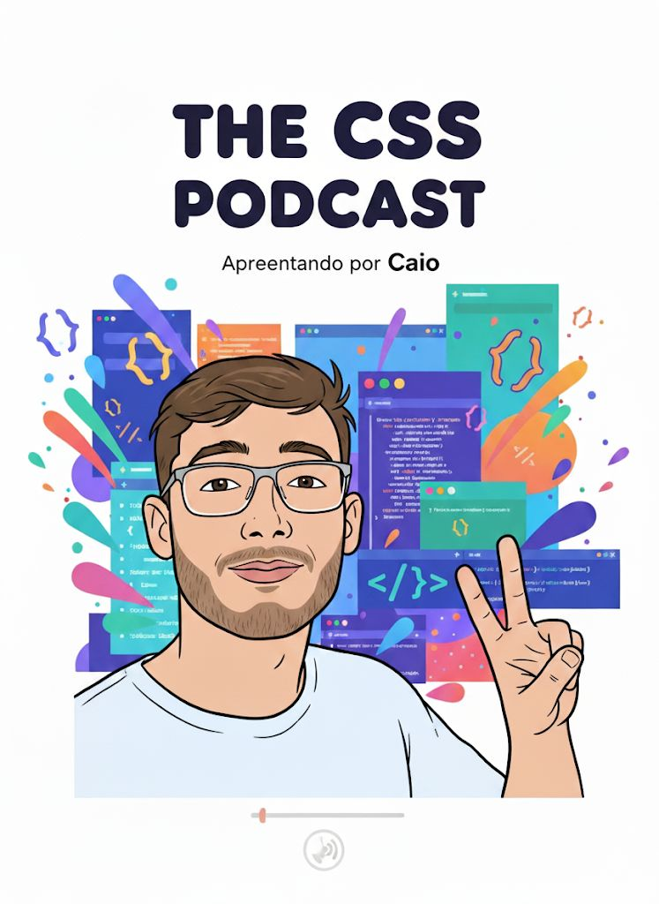

# 🎙️ Entre Linhas e Cores  
### *Descomplicando o visual da web, uma linha por vez!*

  

---

## 🧠 Sobre o Podcast

Entre Linhas e Cores é um podcast criado e apresentado por Caio, voltado para quem está começando no mundo do **CSS** e quer entender, de forma leve e divertida, como cada linha de código ajuda a dar vida aos sites.

Com episódios curtos, linguagem simples e uma pegada descontraída, o podcast mistura curiosidades, dicas práticas e **boas histórias** sobre o universo do design e do front-end.

🎧 Formato dos episódios:
- [Introdução] — estilo animado inspirado no Peter Jordan (canal Ei Nerd)  
- [Curiosidade 1] — um fato interessante sobre CSS  
- [Curiosidade 2] — explicação de uma ferramenta útil (como Bootstrap, Tailwind ou Google Fonts)  
- [Finalização] — encerramento descontraído com o bordão:  
  > “Eu sou o Caio, e esse foi *Entre Linhas e Cores* desta semana!”

---

## 🎬 Episódios

### 🎨 Episódio 1 — *O poder das cores*
> Descubra como o CSS vai além da estética: cores podem transmitir emoções e criar experiências!

*(Novos episódios em breve!)*

---

## 💡 Público-alvo

Esse podcast é feito especialmente para:
- Pessoas que estão **iniciando em CSS**;
- Estudantes de **desenvolvimento web**;
- Quem quer entender o lado **visual e emocional do front-end**.

---

## 🧩 Tecnologias usadas no projeto

- 🎧 **Roteiro e narração:** Caio  
- 📝 **Roteiro criado com auxílio do ChatGPT (GPT-5)**  
- 🗂️ **Organização do projeto:** Markdown / GitHub  
- 🎨 **Design de identidade visual:** inspirado no conceito “código com cor e emoção”

---

## 📢 Bordão oficial

> 🎙️ “Descomplicando o visual da web, uma linha por vez!”

---

## 📱 Contato

📧 **Email:** cbomfimpantoja@gmail.com

---

## 🧾 Licença

Este projeto está sob a licença MIT — sinta-se livre para usar e compartilhar o conteúdo, citando o autor.

---

✨ “Porque cada linha de CSS é uma pincelada no visual da web.” 
